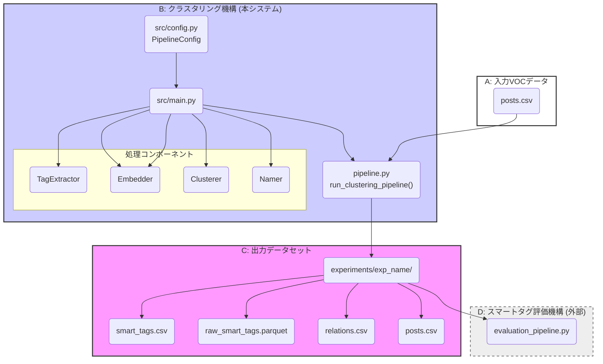
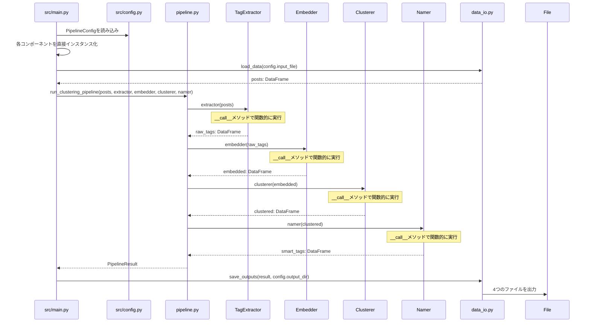

# スマートタグ クラスタリング機構 要件定義書


## 1. 背景と目的

### 1.1. 背景
スマートタグの品質改善には、様々な手法を試し、結果を定量評価するサイクルを高速化する必要があります。しかし、現在の実験プロセスは標準化されておらず、試行錯誤が属人化し、非効率になっています。

### 1.2. 目的
本ドキュメントは、「クラスタリング機構」（以下、本システム）の要件を定義します。

本システムは、入力されたVOCデータから一連の処理（生タグ抽出、Embedding、クラスタリング、正規タグ命名）を実行し、**スマートタグ評価機構**が消費可能な形式でデータセットを出力するオフラインシステムです。

本システムの導入は、以下の実現を目的とします。
-   クラスタリング実験の再現性を確保し、誰でも異なる条件で実験を実行可能にする。
-   実験プロセスを自動化し、タグ品質改善のイテレーションを加速する。
-   生成データセットの形式を統一し、評価機構との連携を円滑にする。

## 2. スコープ

### 2.1. 対象範囲 (In-Scope)
-   指定されたVOC投稿データを入力として受け取ります。
-   設定ファイルに基づき、一連のクラスタリング処理を実行します。
    -   生タグの抽出
    -   生タグのEmbedding（ベクトル化）
    -   Embeddingを用いたクラスタリング
    -   クラスタごとの正規タグ名の生成
-   評価機構が定めるデータ仕様に沿った、4つのファイル群を出力します。

### 2.2. 対象外 (Out-of-Scope)
-   本システムが生成したデータセットの評価。評価は、対となる「スマートタグ評価機構」が担当します。
-   リアルタイムでのオンライン処理。本システムは、開発者が手動で実行するオフラインのバッチ処理を想定します。

## 3. システム要件

### 3.1. 機能要件

| No.  | 要件名                   | 詳細                                                                                                                                     |
| :--- | :----------------------- | :--------------------------------------------------------------------------------------------------------------------------------------- |
| FR-1 | **データ入力**           | 設定ファイルで指定された単一のVOC投稿データ（CSV形式）を読み込む。                                                                       |
| FR-2 | **パイプライン処理**     | 設定ファイルに基づき、「生タグ抽出→Embedding→クラスタリング→正規タグ命名」のパイプライン処理を実行する。                                 |
| FR-3 | **コンポーネントの切替** | パイプラインの各処理（例: クラスタリングアルゴリズム）を、設定ファイルを変更するだけで、異なる実装（例: K-Means, HDBSCAN）に切り替える。 |
| FR-4 | **設定の外部化**         | パイプラインの主要パラメータ（モデル名、クラスタ数など）は、すべて単一の設定ファイル（`config.py`）で管理する。                          |
| FR-5 | **データ出力**           | 処理結果を、評価機構が指定する4つのファイル形式（`normalized_tags.csv`, `raw_tags.parquet`等）で、指定されたディレクトリに出力する。     |

### 3.2. 非機能要件

| No.   | 要件名           | 詳細                                                                                                                                                                       |
| :---- | :--------------- | :------------------------------------------------------------------------------------------------------------------------------------------------------------------------- |
| NFR-1 | **拡張性**       | - 新しいEmbeddingモデルやクラスタリングアルゴリズムを、既存コードへの影響を最小限にして追加可能とする。<br>- 実験パラメータ（`config.py`）の追加・変更を容易にする。       |
| NFR-2 | **保守性**       | 主要機能（データ読み込み、生タグ抽出、Embedding、クラスタリング、命名、出力）を、責務ごとにモジュール化する。                                                              |
| NFR-3 | **再利用性**     | パイプラインの各コンポーネントは疎結合であり、個別に再利用やテストが可能である。                                                                                           |
| NFR-4 | **技術スタック** | - **Python 3.13** を使用<br>- **uv** でパッケージ管理<br>- **pyproject.toml** でプロジェクト設定<br>- **Polars** でデータフレーム処理<br>- **Pydantic** で型安全な設定管理 |

## 4. データI/O仕様

### 4.1. 入力データ
本システムは、唯一の入力として以下の形式を持つVOC投稿データ（CSV）を受け取ります。

**`voc_posts.csv` (入力)**
| カラム名     | 型     | 説明             |
| :----------- | :----- | :--------------- |
| `post_id`    | string | 投稿のユニークID |
| `text`       | string | 投稿の原文       |
| `brand_id`   | string | テナントID       |
| `created_at` | string | 投稿日時         |

### 4.2. 出力データ
本システムは、評価機構が消費する以下の4つのファイル群を出力します。これは「スマートタグ評価機構 要件定義書」の入力仕様と同一です。

**1. `normalized_tags.csv`**
| カラム名              | 型     | 説明                 |
| :-------------------- | :----- | :------------------- |
| `normalized_tag_id`   | string | 正規タグのユニークID |
| `normalized_tag_name` | string | 正規タグの表示名     |

**2. `raw_tags.parquet`**
| カラム名       | 型           | 説明               |
| :------------- | :----------- | :----------------- |
| `raw_tag_id`   | string       | 生タグのユニークID |
| `raw_tag_text` | string       | 生タグの原文       |
| `embedding`    | array[float] | 生タグのベクトル   |

**3. `relations.csv`**
| カラム名            | 型     | 説明              |
| :------------------ | :----- | :---------------- |
| `raw_tag_id`        | string | 生タグのID (FK)   |
| `normalized_tag_id` | string | 正規タグのID (FK) |
| `post_id`           | string | 元の投稿のID (FK) |

**4. `voc_posts.csv`**
(入力された `voc_posts.csv` が、そのまま出力ディレクトリにもコピーされます)

## 5. 補足: 想定アーキテクチャ図

クラスタリング機構の全体像と、関連システムとの連携を以下に示します。



## 6. クラスタリング機構の内部アーキテクチャ

本セクションは、クラスタリング機構のディレクトリ構成と処理フローを定義します。

### 6.1. 設計思想
保守性と拡張性を最大化するため、以下の設計思想に基づきアーキテクチャを設計します。

-   **疎結合 (Loosely Coupled):** 各コンポーネント（データI/O、パイプラインの各ステップ）は、責務が明確に分離され、独立しています。
-   **設定駆動 (Configuration-Driven):** システムの挙動は、コードを変更せず、設定ファイル(`config.py`)で制御します。
-   **拡張性 (Extensibility):** 新しいアルゴリズムは、`components` ディレクトリに新たな実装を追加し、設定ファイルで指定するだけで利用できます。
-   **関数型インターフェース (Functional Interface):** 各コンポーネントは`__call__`メソッドにより関数的に呼び出し可能で、純粋関数的な処理を実現します。

### 6.2. ディレクトリ構成案

```
smart-tag-clusterer/
├── pyproject.toml          # プロジェクト設定（uv用）
├── uv.lock                 # 依存関係ロックファイル
├── README.md               # プロジェクト説明
│
├── src/
│   ├── main.py             # エントリポイント
│   ├── config.py           # 実験設定ファイル（Pydantic）
│   ├── pipeline.py         # パイプライン実行ロジック
│   ├── data_io.py          # 入出力処理
│   │
│   ├── processors/
│   │   ├── tag_extractor.py    # 生タグ抽出
│   │   ├── embedder.py     # Embedding実行
│   │   ├── clusterer.py    # クラスタリング実行
│   │   └── namer.py        # スマートタグ命名
│   │
│   └── providers/
│       ├── llm_providers.py       # OpenAI, Claude等
│       ├── embedding_providers.py # 複数Embeddingモデル
│       └── clustering_providers.py    # KMeans, HDBSCAN等
│
├── tests/
│   ├── test_components.py
│   ├── test_pipeline.py
│   └── test_config.py
│
└── experiments/
    ├── exp1_kmeans/
    └── exp2_hdbscan/
```

### 6.3. 処理フロー



### 6.4. コンポーネント設計パターン

本システムでは、実験における再現性と拡張性を重視し、**軽量クラス + 関数型ハイブリッド**設計パターンを採用します。

#### 6.4.1. 設計原則

- **関数的インターフェース**: 各コンポーネントは`__call__`メソッドにより関数的に呼び出し可能
- **状態の最小化**: コンポーネントは設定とリソースのみを保持し、処理状態は持たない
- **純粋性の追求**: 入力に対して決定論的な出力を生成し、副作用を最小限に抑制
- **高速なデータ処理**: Polarsによる効率的なDataFrame操作
- **型安全性**: Pydanticによる設定管理とmypyによる静的型チェック

#### 6.4.2. 実装例

```python
import polars as pl
from pydantic import BaseModel
from .providers.llm_providers import OpenAIProvider, ClaudeProvider

class TagExtractionConfig(BaseModel):
    provider: str = "openai"
    model: str = "gpt-4"
    temperature: float = 0.1
    api_key: str

class TagExtractor:
    """軽量クラス実装例"""
    def __init__(self, config: TagExtractionConfig):
        self.config = config
        # Providerが依存関係を内包
        if config.provider == "openai":
            self.provider = OpenAIProvider(config.api_key)
        elif config.provider == "claude":
            self.provider = ClaudeProvider(config.api_key)
    
    def __call__(self, posts: pl.DataFrame) -> pl.DataFrame:
        """関数的インターフェース - Polarsで高速処理"""
        return self.provider.extract_tags(posts, self.config.model)

# シンプルな使用方法 - main.pyで直接作成
config = PipelineConfig.load()
extractor = TagExtractor(config.tag_extraction)
raw_tags = extractor(voc_posts)  # 関数的に呼び出し
```

#### 6.4.3. 実験追跡との統合

```python
import polars as pl
from pydantic import BaseModel

class PipelineConfig(BaseModel):
    input_file: str
    output_dir: str
    tag_extraction: TagExtractionConfig
    embedding: EmbeddingConfig
    clustering: ClusteringConfig

def main():
    """シンプルなメイン関数 - main.py"""
    config = PipelineConfig.load()
    
    # 直接インスタンス化 - Factory不要
    extractor = TagExtractor(config.tag_extraction)
    embedder = Embedder(config.embedding)
    clusterer = Clusterer(config.clustering)
    namer = Namer(config.naming)
    
    # データ読み込み
    voc_posts = load_data(config.input_file)
    
    # パイプライン実行
    result = run_clustering_pipeline(voc_posts, extractor, embedder, clusterer, namer)
    
    # 結果保存
    save_outputs(result, config.output_dir)

def run_clustering_pipeline(posts: pl.DataFrame, extractor, embedder, clusterer, namer):
    """シンプルなパイプライン実行"""
    # 段階的実行（各ステップで結果確認可能）
    raw_tags = extractor(posts)
    embedded = embedder(raw_tags)
    clustered = clusterer(embedded)
    smart_tags = namer(clustered)
    
    return PipelineResult(
        raw_tags=raw_tags,
        embedded=embedded,
        clustered=clustered,
        smart_tags=smart_tags
    )

# uvでのプロジェクト実行例
# uv run python src/main.py
```
